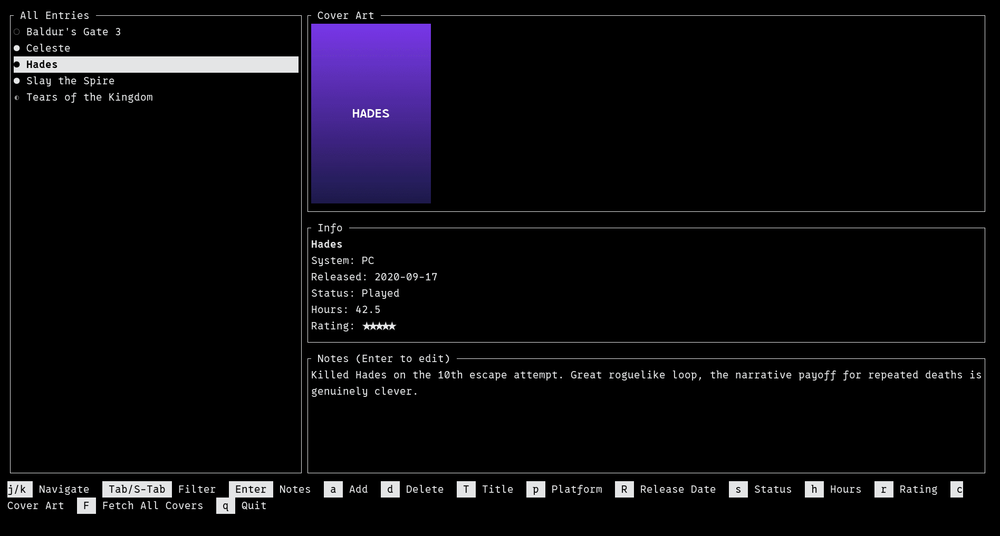
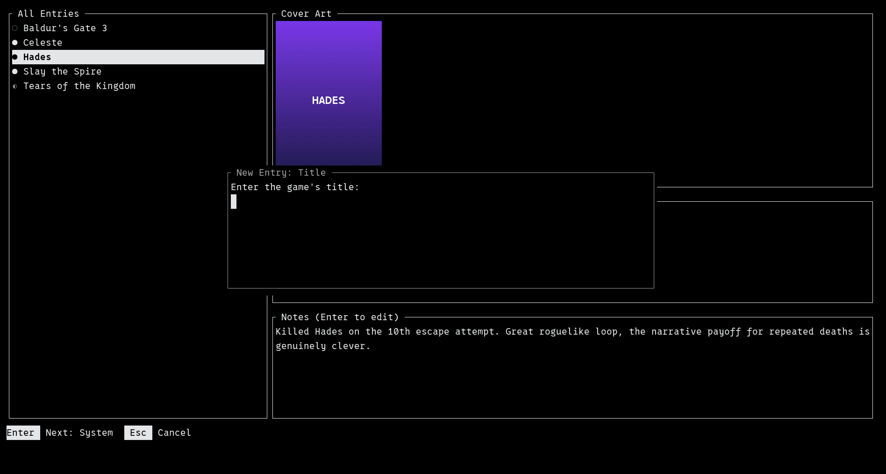
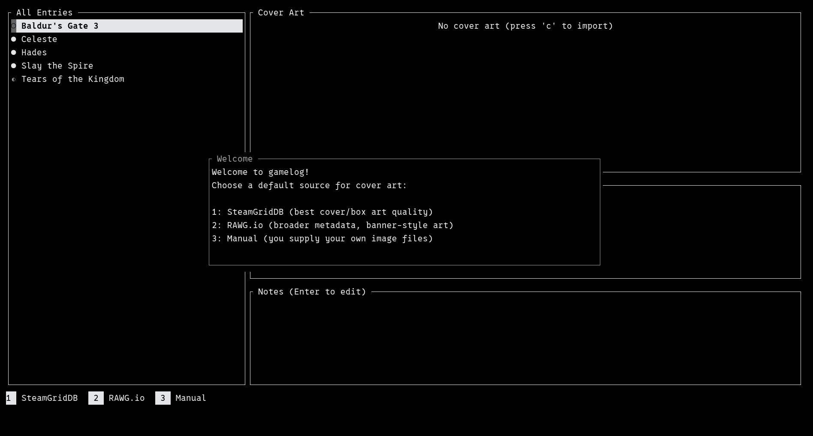

# gamelog

A terminal UI for logging and tracking the video games you play, written in Rust with [ratatui](https://ratatui.rs/).

Track title, system, status, hours played, a 5-star rating, cover art, and freeform notes for every game — all from a fast, keyboard-driven split-pane interface, with your data stored as plain JSON in a single hidden directory in your home folder.

## Screenshots

**Browsing your library**, with cover art rendered inline (real graphics on Kitty/iTerm2/Sixel-capable terminals, a Unicode half-block fallback elsewhere):



**Adding a new entry**, via a small modal popup — the same pattern used for editing any field, confirming deletes, and setting a rating:



**First-run setup**, where you choose a default source for automatic cover art:



## Features

- **Split-pane browsing** — a scrollable list on the left (toggle between all entries and a single system with `Tab`/`Shift+Tab`), and a detail pane on the right showing cover art, info, and notes for the selected entry.
- **Search and sort** — press `/` to filter the list by title as you type (case-insensitive), and `o` to sort by title, hours played, rating, release date, last played, or status (`O` reverses the order). Your chosen sort is remembered between runs; entries without a rating, release date, or play session always sink to the bottom.
- **CSV import/export** — `E` saves your whole library as a CSV file (title, system, status, hours, rating, release date, last played, notes), and `I` adds entries from one. Import is forgiving so spreadsheets and other trackers' exports work: only `title` and `system` columns are required (`name`/`platform` also work), column order and header case don't matter, extra columns are ignored, and statuses like "Completed" or "In Progress" are understood. Rows already in your library (same title and system, ignoring case) are skipped, so re-importing a file never creates duplicates, and any bad rows are reported by line number without stopping the rest. Cover art isn't included.
- **Full entry model** — title, system/platform, release date, status (*Want to Play* / *Playing* / *Played*), hours played, last played date, a 0–5 star rating, cover art, and freeform persistent notes.
- **Play sessions** — press `t` to start a live timer when you sit down to play, and press it again when you stop; the elapsed time is added to that entry's hours automatically, and its *last played* date is updated. A running session is always visible in the footer, even while you browse other entries, and is safely finalized if you quit mid-session.
- **Automatic cover art**, from either of two free APIs, or your own image files:
  - [SteamGridDB](https://www.steamgriddb.com/) — purpose-built box/grid art, best visual quality.
  - [RAWG.io](https://rawg.io/apidocs) — broader metadata coverage, banner-style images.
  - Manual — point at a local image file yourself with `c`.

  A first-run wizard asks which source you'd like as your default (prompting for its free API key if you pick an online one). New entries automatically try to fetch cover art from that default; if it fails or finds nothing, a popup lets you try the other source, import a file, or skip entirely.
- **`Fetch All Covers`** — backfill cover art for every entry that's missing one, all in the background. Fetches run through a small worker pool (never more than a handful of requests in flight at once, regardless of library size) and automatically retry with backoff if an API rate-limits you.
- **Fully asynchronous fetching** — cover art downloads never block the UI; you can keep browsing and editing while they run.
- **Configurable keybindings** — every action's key is read from a plain TOML file (`~/.gamelog/keybindings.toml`), generated with comments on first run. A live help bar along the bottom always reflects whatever you've actually bound.
- **Optional GUI** — run with `--gui` for a native desktop window instead of the terminal UI, driven by buttons and dialogs rather than keybindings. It reads and writes the exact same `~/.gamelog` data, so you can switch between the two freely. See [GUI mode](#gui-mode) below.
- **Everything in one hidden folder** — your library (`entries.json`), imported/downloaded cover art (`covers/`), keybindings, and settings all live under `~/.gamelog`, not scattered across platform-specific config directories.
- **Safe writes** — saves are atomic (written to a temp file, then renamed into place), so an interrupted write can't corrupt your library.

## Installing

### Prerequisites

- A Rust toolchain (install via [rustup](https://rustup.rs/) if you don't have one).
- A terminal emulator. Any ANSI terminal works; for inline cover art images, use one that supports the Kitty, iTerm2, or Sixel graphics protocol (e.g. [kitty](https://sw.kovidgoyal.net/kitty/), [foot](https://codeberg.org/dnkl/foot), [WezTerm](https://wezfurlong.org/wezterm/)) — other terminals still work, falling back to a Unicode block-art rendering of the cover.

### Build from source

```sh
git clone https://github.com/colorlesspilgrimage/gamelog.git
cd gamelog
cargo build --release
```

The compiled binary will be at `target/release/gamelog`.

### Install it somewhere on your `PATH`

Either let Cargo install it for you:

```sh
cargo install --path .
```

(this places it at `~/.cargo/bin/gamelog`, which `rustup` puts on your `PATH` by default), or copy the release binary manually:

```sh
cp target/release/gamelog ~/.local/bin/
```

Then just run:

```sh
gamelog
```

## Configuration

Everything gamelog stores lives under `~/.gamelog/`:

| File | Purpose |
|---|---|
| `entries.json` | Your game library. |
| `covers/` | Cover art images, imported or downloaded. |
| `keybindings.toml` | Key-to-action bindings, written with comments on first run. |
| `settings.toml` | Your default cover art source and API keys. |

Edit `keybindings.toml` or `settings.toml` in any text editor and restart gamelog to pick up changes.

## GUI mode

Prefer a mouse-driven interface? Launch gamelog with `--gui` for a native desktop window (built with [egui](https://github.com/emilk/egui)/[eframe](https://github.com/emilk/eframe)) instead of the terminal UI:

```sh
gamelog --gui
```

It's the same library underneath — the GUI reads and writes the exact same `entries.json`, `covers/`, and `settings.toml` as the terminal UI, so you can switch between the two freely, even mid-session. Every feature described above is available: browsing, filtering by system, title search and sorting, the full entry model, play sessions (with a live-counting timer), the first-run cover art wizard, automatic cover art fetching with fallback, `Fetch All Covers`, manual cover art import via a native file picker, and CSV import/export through native open/save dialogs.

The one thing that doesn't carry over is `keybindings.toml`: the GUI is driven entirely by on-screen buttons and dialogs rather than configurable keys, since there's no keyboard-hint footer to remap.

## Default keybindings

*(Terminal UI only — the GUI uses on-screen buttons instead; see [GUI mode](#gui-mode).)*

Shown contextually along the bottom of the screen at all times; the primary browsing keys are below and fully customizable via `keybindings.toml`.

| Key | Action |
|---|---|
| `j` / `k` (or `↓` / `↑`) | Navigate the list |
| `Tab` / `Shift+Tab` | Cycle the system filter |
| `Enter` | Edit notes |
| `a` | Add an entry |
| `d` | Delete the selected entry |
| `T` | Edit title |
| `p` | Edit system/platform |
| `R` | Edit release date |
| `s` | Cycle status |
| `h` | Edit hours played |
| `t` | Start/stop a play session (adds elapsed time to hours played) |
| `r` | Set rating |
| `c` | Import cover art from a local file |
| `F` | Fetch cover art for every entry that's missing one |
| `/` | Search by title (`Enter` to keep the search, `Esc` to clear it) |
| `o` / `O` | Cycle the sort order / reverse it |
| `I` / `E` | Import entries from / export the library to a CSV file |
| `q` (or `Esc`) | Quit (`Esc` clears an active search first) |

## License

MIT — see [LICENSE](LICENSE).
